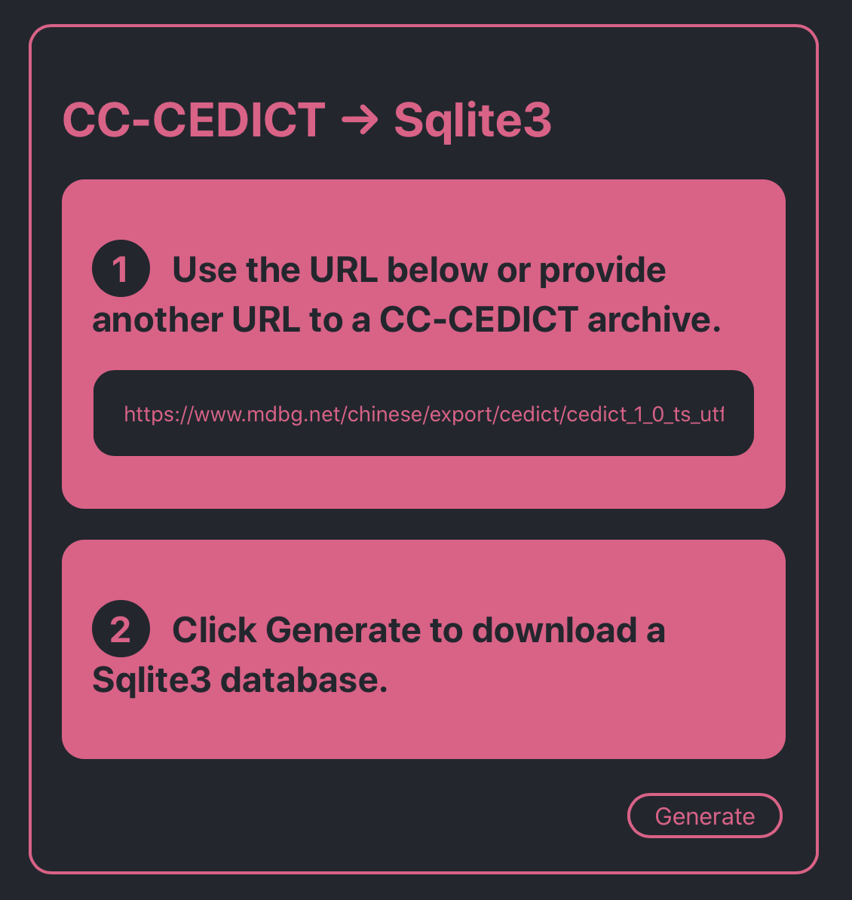

> # Rationale
> This tool will convert a CC-CEDICT file to a Sqlite3 file, that can be used for example as the database for a mobile dictionary app.
> For more infos on CC-CEDICT visit: https://cc-cedict.org/wiki/

> # How to run
> ```console
>you@pc:~/cedict-to-sqlite$ cd client
>you@pc:~/cedict-to-sqlite$ npm install && npm run build
>you@pc:~/cedict-to-sqlite$ cd ../
>you@pc:~/cedict-to-sqlite$ npm	install && npm run dev
>```
> Visit http://localhost:8090 in your favourite browser
>
><!-- .element height="90%" width="90%" -->

> # Dev enviroment
> NPM 6.7.0
> Node 11.15.0
